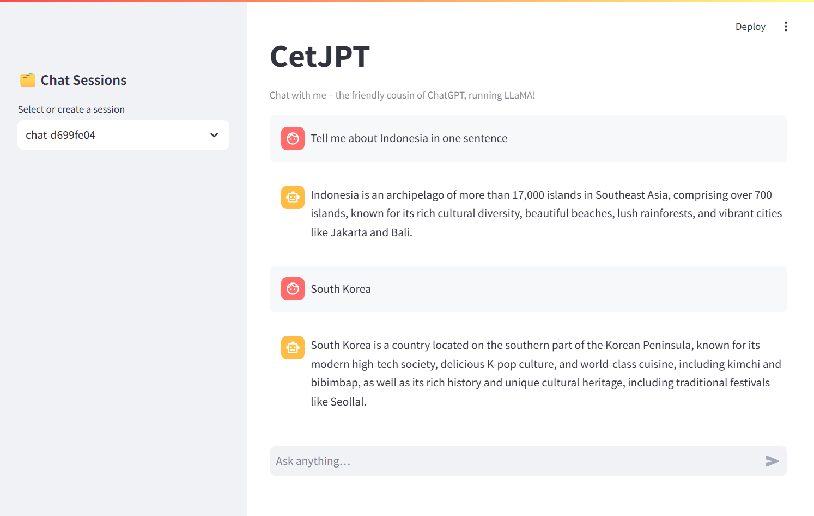

# Langchain Tutorial

🧠 A hands-on learning repo for mastering [LangChain](https://www.langchain.com/) concepts — from fundamentals to real-world apps.

## 📚 Overview

This repository is designed for **learning LangChain step-by-step** through interactive Jupyter Notebooks and simple projects. It starts with the basics (prompt templates, chains, LLMs) and gradually progresses to more advanced topics like agents and tool integrations.

The repo also includes two working **Streamlit apps**:

- 💬 **Chatbot App**: A conversational agent that maintains **chat history**.
- 📄 **Resume Parser App**: Extracts structured information from uploaded resumes using LLMs.

---

## 🚀 Tech Stack

- **LangChain**
- **Streamlit**
- **Ollama**

---

## 🗂️ Folder Structure

```
tutor-langchain/
│
├── notebooks/ # Jupyter notebooks for LangChain tutorials
├── apps/ # Streamlit-based apps
├── data/ # Datasets used in notebooks
├── scripts/ # Scripts used in notebooks
├── store/ # Vector stores for RAG
├── requirements.txt # Dependencies
└── README.md
```

## 📘 Usage

### ▶️ Learn with Notebooks

Navigate to the notebooks/ directory and open any file in Jupyter or VS Code to start exploring.

### 💬 Run the Chatbot App

```
cd chatbot
streamlit run app.py
```

### 📄 Run the Resume Parser App

```
cd resume_parser
streamlit run app.py
```

---

## 🖼️ Screenshots

### Chatbot App



### Resume Parser


